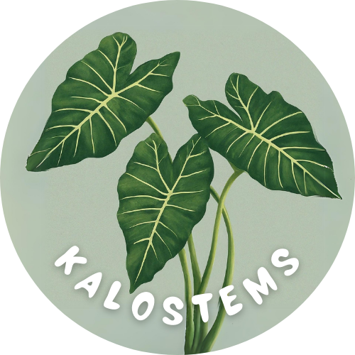
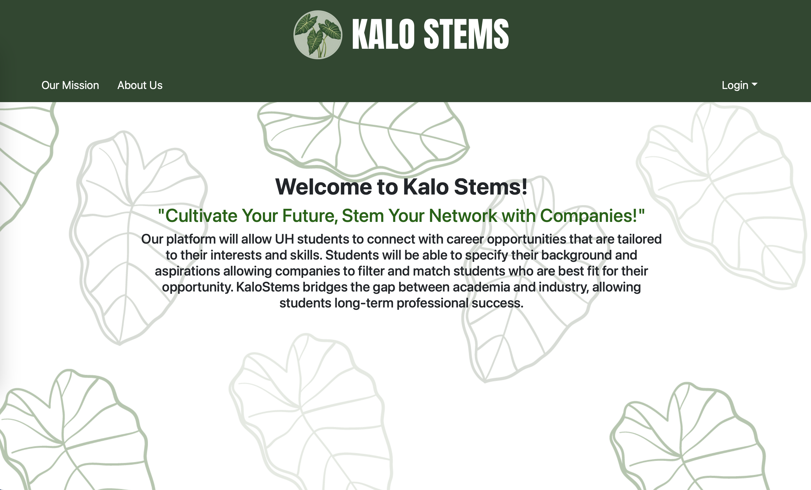
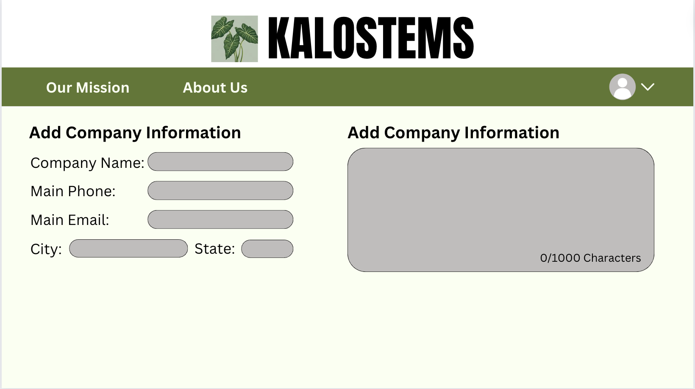
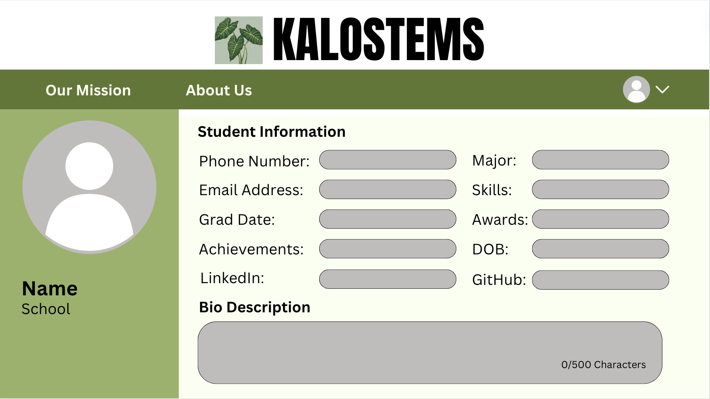
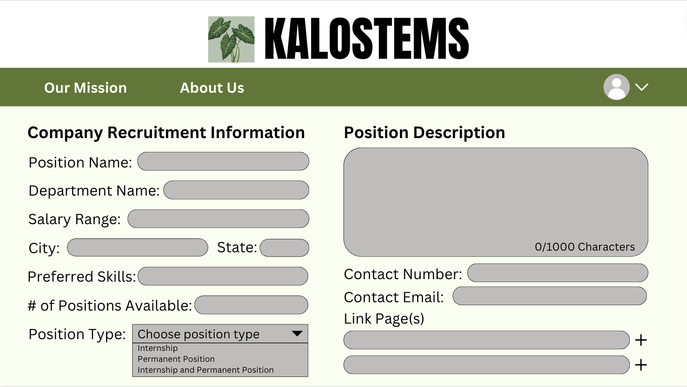
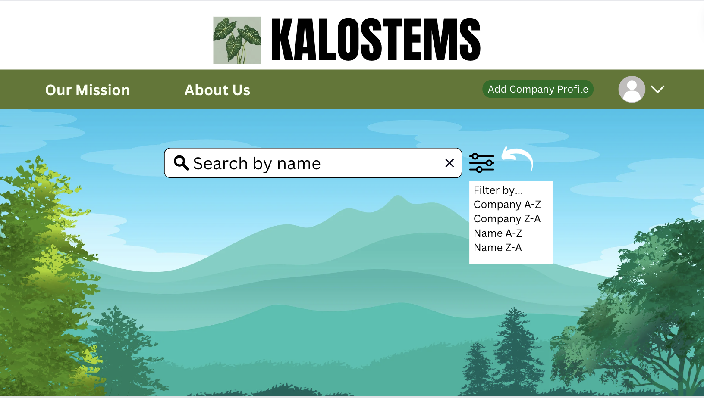

 

## Table of contents

* [Overview](#overview)
* [Deployment](#deployment)
* [User Guide](#user-guide)
* [Developer Guide](#developer-guide)
* [Development History](#development-history)
* [Continuous Integration](#continuous-integration)
* [Walkthrough videos](#walkthrough-videos)
* [Example enhancements](#example-enhancements)
* [Team](#team)

## Overview

Our platform, Kalo Stems, will allow UH students to connect with career opportunities that are tailored to their interests and skills. Students will be able to specify their background and aspirations, allowing companies to filter and match students who are best fit for their opportunity. KaloStems bridges the gap between academia and industry, allowing students long-term professional success. This application will illustrate various technologies useful to ICS software engineering student, including: 

* [Meteor](https://www.meteor.com/) for Javascript-based implementation of client and server code.
* [React](https://react.dev/) for component-based UI implementation and routing.
* [React](https://react-bootstrap.github.io/) Bootstrap CSS Framework for UI design.
* [Uniforms](https://uniforms.tools/) for React and Semantic UI-based form design and display.

## Deployment
[Kalo Stems](http://209.38.128.154/)

## User Guide
This section provides a walkthrough of the Kalo-Stem user interface and its capabilities.

### Landing Page
The landing page mockup is presented to users when they visit the top-level URL to the site. 

*Insert an image of 



### Profile pages 
Kalo Stems has two types of profile pages: Company and Student, depending on the users title.

The Company profile page contains basic company information about the company itself:



The Student profile page contains brief information about the student and also links to their LinkedIn and Professional Portfolio:




### Company Recruitment Form
Specific to the Company Login, to advertise a specific job, there is a recruitment form that can be filled out accordingly:



### Search and Filtering
There will be a search bar where you can search for a specific company or student, or you can filter the type of company/student you are looking for:



## Community Feedback
We are interested in your experience using Kalo-Stems! If you would like, please take a couple of minutes to fill out the [Kalo-Stems Feedback Form](https://forms.gle/2oKuKomB4vn7Znak6). It contains only five short questions and will help us understand how to improve the system.

## Developer Guide
This section provides information of interest to Meteor developers wishing to use this code base as a basis for their own development tasks.

### Installation
First, [Install Meteor](https://docs.meteor.com/install.html).

Second, visit the [Kalo-Stems application github page](https://github.com/kalo-stems/kalo-stems.github.io), and click the "Use this template" button to create your own repository initialized with a copy of this application. Alternatively, you can download the sources as a zip file or make a fork of the repo. However you do it, download a copy of the repo to your local computer.

Third, cd into the bowfolios/app directory and install libraries with:
```angular2html
$ meteor npm install
```

Fourth, run the system with:
```angular2html
$ meteor npm run start
```

If all goes well, the application will appear at [http://localhost:3000](http://localhost:3000).

### Application Design
Kalo-Stems is based upon [meteor-application-template-react](https://ics-software-engineering.github.io/meteor-application-template-react/) and [meteor-example-form-react](https://ics-software-engineering.github.io/meteor-example-form-react/).  Please use the videos and documentation at those sites to better acquaint yourself with the basic application design and form processing in Kalo-Stems.

## Development Timeline
The development process for BowFolios conformed to [Issue Driven Project Management](http://courses.ics.hawaii.edu/ics314f19/modules/project-management/) practices. In a nutshell:

* Development consists of a sequence of Milestones.
* Each Milestone is specified as a set of tasks.
* Each task is described using a GitHub Issue, and is assigned to a single developer to complete.
* Tasks should typically consist of work that can be completed in 2-4 days.
* The work for each task is accomplished with a git branch named "issue-XX", where XX is replaced by the issue number.
* When a task is complete, its corresponding issue is closed and its corresponding git branch is merged into master.
* The state (todo, in progress, complete) of each task for a milestone is managed using a GitHub Project Board.

The following sections document the development history of Kalo-Stems.

## Continuous Integration
Kalo-Stems uses [Github Actions](https://docs.github.com/en/free-pro-team@latest/actions) to automatically run ESLint and TestCafe each time a commit is made to the default branch.  You can see the results of all recent "workflows" at [https://github.com/kalo-stems/kalo-stems.github.io/actions](https://github.com/kalo-stems/kalo-stems.github.io/actions).

## Team
Kalo-Stem is designed and implemented by [Natalie Dang](https://ndang562.github.io/), [Emily Hsu](https://ehsugit.github.io/), [Samantha Kocher](https://samanthakocher.github.io/), [Roma Malasarte](https://romamalasarte.github.io/), [Rina Ogino](https://rinaogino.github.io/), and [Jaira Pader](https://jairabp.github.io/). 
All members signed and agreed to the following [contract](https://docs.google.com/document/d/1pQhVukBdsgP-iYddv36u0Z7tSdybe16vppzxzfB3U6Q/edit?usp=sharing), discussing overall guidelines to working in this team.

## Links
* [Contract](https://docs.google.com/document/d/1pQhVukBdsgP-iYddv36u0Z7tSdybe16vppzxzfB3U6Q/edit?usp=sharing)
* [KaloStems Team](https://github.com/orgs/kalo-stems/teams/kalo-stems)
* [Slideshow](https://www.canva.com/design/DAGBZoxKtCk/fQQk6ZFbjSCNc1vgeSsEIQ/edit)
* [M1](https://github.com/orgs/kalo-stems/projects/3/views/1)
